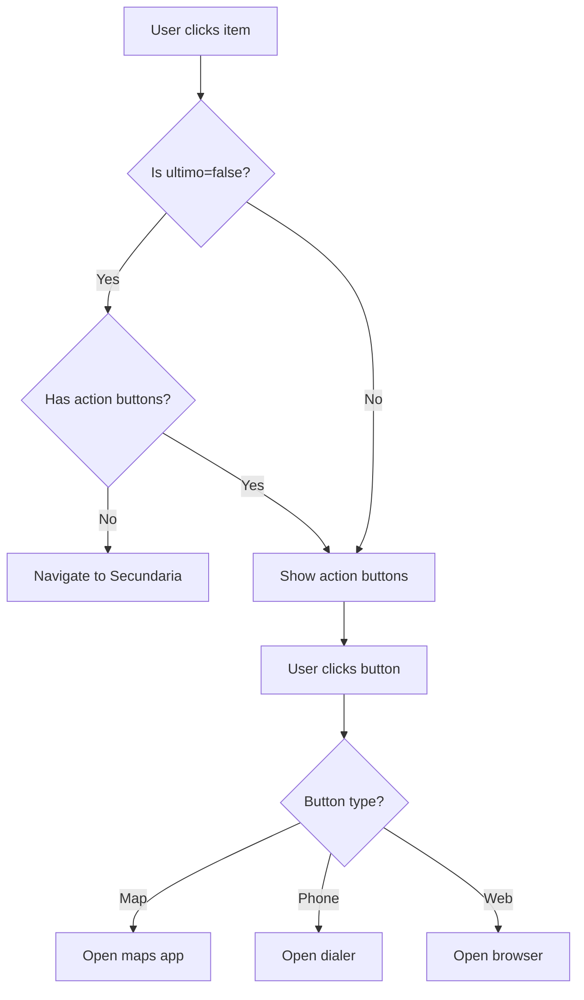

## Overview

The `Adaptador` class is a custom `RecyclerView.Adapter` that manages the display of encyclopedia entries. It handles data binding, image loading via Picasso, dynamic button visibility, and click event routing based on entry type.

<Note>
This adapter implements conditional UI logic: non-terminal entries navigate to detail views, while terminal entries display action buttons (map, phone, web).
</Note>

## Package

```java
com.example.huelvapedia
```

## Class Declaration

```java
public class Adaptador extends RecyclerView.Adapter<Adaptador.MiViewHolder> 
    implements View.OnClickListener
```

**Inheritance:**
- Extends: `RecyclerView.Adapter<Adaptador.MiViewHolder>`
- Implements: `View.OnClickListener`

## Dependencies

| Library | Usage |
|---------|-------|
| AndroidX RecyclerView | List display and adapter framework |
| Picasso | Image loading and caching |
| Android SDK | Context, Intent, Uri handling |

## Fields

| Field | Type | Access | Description |
|-------|------|--------|-------------|
| `context` | `Context` | private | Application context for inflating layouts and starting activities |
| `elementos` | `ArrayList<Elementos>` | private | List of encyclopedia entries to display |
| `listener` | `View.OnClickListener` | private | Optional external click listener for item clicks |

## Constructor

```java
public Adaptador(Context context, ArrayList<Elementos> elementos)
```

Creates a new adapter instance.

**Parameters:**
- `context` - Application or activity context
- `elementos` - List of `Elementos` objects to display

**Usage Example:**
```java
ArrayList<Elementos> monumentos = new ArrayList<>();
// Populate monumentos from Firebase

Adaptador adapter = new Adaptador(this, monumentos);
RecyclerView recyclerView = findViewById(R.id.principal);
recyclerView.setAdapter(adapter);
```

## RecyclerView Methods

### onCreateViewHolder

```java
@NonNull
@Override
public MiViewHolder onCreateViewHolder(@NonNull ViewGroup parent, int viewType)
```

Inflates the item layout and creates a new ViewHolder.

**Parameters:**
- `parent` - The parent ViewGroup
- `viewType` - The view type (unused in this implementation)

**Returns:** `MiViewHolder` - A new ViewHolder instance

**Implementation Details:**
- Inflates `R.layout.principal` layout
- Sets the adapter as the click listener for the entire item view
- Creates and returns a `MiViewHolder` instance

### onBindViewHolder

```java
@Override
public void onBindViewHolder(@NonNull MiViewHolder holder, int position)
```

Binds data to the ViewHolder at the specified position. This is where the conditional UI logic is implemented.

**Parameters:**
- `holder` - The ViewHolder to bind data to
- `position` - The position in the data list

**Behavior:**

<Steps>
<Step title="Bind Basic Data">
Sets the name, description, and loads the image using Picasso:
```java
holder.nombre.setText(elemento.getNombre());
holder.descripcion.setText(elemento.getDescripcion());
Picasso.get().load(elemento.getFoto()).into(holder.imagen);
```
</Step>

<Step title="Check Entry Type">
Determines if this is a terminal entry (ultimo = true) or navigational entry:
```java
if (!elemento.getUltimo()) {
    // Hide action buttons, enable navigation
} else {
    // Show action buttons, disable navigation
}
```
</Step>

<Step title="Configure Actions">
For terminal entries, configures up to three action buttons based on available data:
- **Location button**: Opens maps app with coordinates
- **Phone button**: Opens dialer with phone number
- **Link button**: Opens web browser with URL
</Step>
</Steps>

**Non-Terminal Entry Logic:**
```java
if (!elemento.getUltimo()) {
    holder.botonUbicacion.setVisibility(View.GONE);
    holder.botonLlamar.setVisibility(View.GONE);
    holder.botonEnlace.setVisibility(View.GONE);
    
    if (!tieneUbicacion && !tieneTelefono && !tieneEnlace) {
        holder.itemView.setOnClickListener(v -> {
            Intent intent = new Intent(v.getContext(), Secundaria.class);
            intent.putExtra("Nombre", elemento.getNombre());
            v.getContext().startActivity(intent);
        });
    }
}
```

**Terminal Entry - Location Button:**
```java
if (tieneUbicacion) {
    holder.botonUbicacion.setOnClickListener(v -> {
        Intent intent = new Intent(Intent.ACTION_VIEW);
        intent.setData(Uri.parse(elemento.getUbicacion1() + 
            Uri.encode(elemento.getUbicacion2())));
        Intent chooser = Intent.createChooser(intent, "Launch Maps");
        v.getContext().startActivity(chooser);
    });
} else {
    holder.botonUbicacion.setVisibility(View.GONE);
}
```

**Terminal Entry - Phone Button:**
```java
if (tieneTelefono) {
    holder.botonLlamar.setOnClickListener(v -> {
        Intent intent = new Intent(Intent.ACTION_DIAL);
        intent.setData(Uri.parse("tel:" + elemento.getTelefono()));
        v.getContext().startActivity(intent);
    });
} else {
    holder.botonLlamar.setVisibility(View.GONE);
}
```

**Terminal Entry - Web Link Button:**
```java
if (tieneEnlace) {
    holder.botonEnlace.setOnClickListener(v -> {
        Uri link = Uri.parse(elemento.getEnlace());
        Intent intent = new Intent(Intent.ACTION_VIEW, link);
        v.getContext().startActivity(intent);
    });
} else {
    holder.botonEnlace.setVisibility(View.GONE);
}
```

### getItemCount

```java
@Override
public int getItemCount()
```

Returns the total number of items in the adapter.

**Returns:** `int` - Size of the elementos list

## Click Handling Methods

### setOnClickListener

```java
public void setOnClickListener(View.OnClickListener listener)
```

Sets an external click listener for item views.

**Parameters:**
- `listener` - The click listener to invoke when items are clicked

### onClick

```java
@Override
public void onClick(View v)
```

Handles click events and delegates to the external listener if set.

**Parameters:**
- `v` - The clicked view

## MiViewHolder Inner Class

```java
static class MiViewHolder extends RecyclerView.ViewHolder
```

ViewHolder pattern implementation that caches view references for performance.

### Fields

| Field | Type | Description |
|-------|------|-------------|
| `nombre` | `TextView` | Displays the entry name |
| `descripcion` | `TextView` | Displays the entry description |
| `imagen` | `ImageView` | Displays the entry photo |
| `botonUbicacion` | `Button` | Action button for opening maps |
| `botonLlamar` | `Button` | Action button for dialing phone |
| `botonEnlace` | `Button` | Action button for opening web link |

### Constructor

```java
public MiViewHolder(@NonNull View itemView)
```

Initializes the ViewHolder by finding and caching all view references.

**Parameters:**
- `itemView` - The inflated item layout view

**Implementation:**
```java
public MiViewHolder(@NonNull View itemView) {
    super(itemView);
    
    nombre = itemView.findViewById(R.id.tenombre);
    descripcion = itemView.findViewById(R.id.tedescri);
    imagen = itemView.findViewById(R.id.imagen);
    botonUbicacion = itemView.findViewById(R.id.botonubi);
    botonLlamar = itemView.findViewById(R.id.botonllamar);
    botonEnlace = itemView.findViewById(R.id.botonwiki);
}
```

## Usage Patterns

### Basic Setup with RecyclerView

```java
public class Principal extends AppCompatActivity {
    private RecyclerView recyclerView;
    private Adaptador adapter;
    private ArrayList<Elementos> listaElementos;
    
    @Override
    protected void onCreate(Bundle savedInstanceState) {
        super.onCreate(savedInstanceState);
        setContentView(R.layout.activity_principal);
        
        // Initialize RecyclerView
        recyclerView = findViewById(R.id.principal);
        recyclerView.setHasFixedSize(true);
        recyclerView.setLayoutManager(new LinearLayoutManager(this));
        
        // Create adapter with data
        listaElementos = new ArrayList<>();
        adapter = new Adaptador(this, listaElementos);
        recyclerView.setAdapter(adapter);
        
        // Load data from Firebase
        loadDataFromFirebase();
    }
}
```

### Updating Data

```java
// After loading new data from Firebase
private void loadDataFromFirebase() {
    DatabaseReference ref = FirebaseDatabase.getInstance()
        .getReference("monumentos");
    
    ref.addValueEventListener(new ValueEventListener() {
        @Override
        public void onDataChange(DataSnapshot snapshot) {
            listaElementos.clear();
            
            for (DataSnapshot data : snapshot.getChildren()) {
                Elementos elemento = data.getValue(Elementos.class);
                listaElementos.add(elemento);
            }
            
            // Notify adapter of data changes
            adapter.notifyDataSetChanged();
        }
        
        @Override
        public void onCancelled(DatabaseError error) {
            // Handle error
        }
    });
}
```

### Custom Item Click Handling

```java
adapter.setOnClickListener(new View.OnClickListener() {
    @Override
    public void onClick(View v) {
        // Get the clicked position
        int position = recyclerView.getChildAdapterPosition(v);
        
        // Handle the click
        Elementos clickedItem = listaElementos.get(position);
        Toast.makeText(Principal.this, 
            "Clicked: " + clickedItem.getNombre(), 
            Toast.LENGTH_SHORT).show();
    }
});
```

## Intent Actions

<CardGroup cols={3}>
<Card title="Maps Integration" icon="map">
**Action:** `Intent.ACTION_VIEW`

**Data Format:**
```java
"geo:0,0?q=" + Uri.encode(address)
```

Uses intent chooser to allow user to select maps app.
</Card>

<Card title="Phone Dialer" icon="phone">
**Action:** `Intent.ACTION_DIAL`

**Data Format:**
```java
"tel:" + phoneNumber
```

Opens dialer with pre-filled number (doesn't auto-dial).
</Card>

<Card title="Web Browser" icon="globe">
**Action:** `Intent.ACTION_VIEW`

**Data Format:**
```java
Uri.parse(webUrl)
```

Opens default browser or app chooser.
</Card>
</CardGroup>

## Performance Considerations

<AccordionGroup>
<Accordion title="ViewHolder Pattern">
The `MiViewHolder` class implements the ViewHolder pattern, caching view references to avoid repeated `findViewById()` calls during scrolling. This significantly improves RecyclerView performance.
</Accordion>

<Accordion title="Picasso Image Loading">
Picasso handles:
- Asynchronous image loading
- Memory and disk caching
- Image resizing and transformation
- Automatic memory management

No manual cache management is required.
</Accordion>

<Accordion title="Data Updates">
When data changes, call `notifyDataSetChanged()` on the adapter. For more efficient updates, consider:
- `notifyItemInserted(position)`
- `notifyItemRemoved(position)`
- `notifyItemChanged(position)`
</Accordion>
</AccordionGroup>

## Layout Requirements

The adapter expects `R.layout.principal` to contain the following view IDs:

```xml
<!-- Required view IDs -->
<TextView android:id="@+id/tenombre" />
<TextView android:id="@+id/tedescri" />
<ImageView android:id="@+id/imagen" />
<Button android:id="@+id/botonubi" />
<Button android:id="@+id/botonllamar" />
<Button android:id="@+id/botonwiki" />
```

## Navigation Flow



## See Also

- [Elementos](/api/elementos) - Data model class used by this adapter
- [MainActivity](/api/mainactivity) - Activity that uses this adapter
- [Secundaria Activity](/api/secundaria) - Detail view for non-terminal entries
- [Architecture Overview](/architecture/overview) - Learn more about the app's architecture