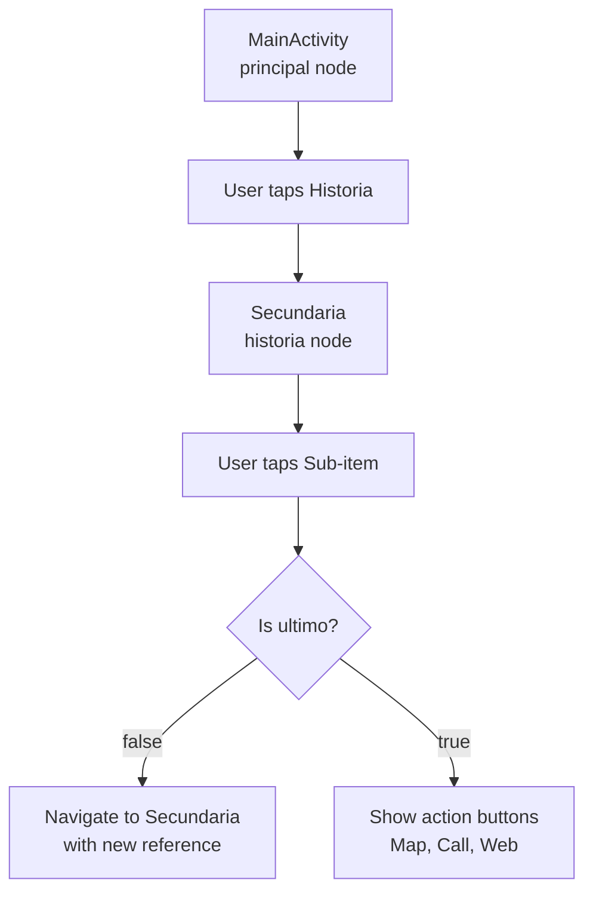

## Overview

HuelvaPedia implements a **hierarchical navigation system** that allows users to explore encyclopedia content by drilling down from main categories to detailed information. The architecture uses two main activities (`MainActivity` and `Secundaria`) connected through an intelligent adapter pattern.

## Navigation Flow

<Steps>
  <Step title="Main Screen">
    Users start at `MainActivity`, which displays top-level categories (Historia, Gastronomía, etc.) loaded from Firebase's `principal` node.
  </Step>
  
  <Step title="Category Selection">
    Tapping a category navigates to `Secundaria` activity, passing the category name via Intent extras.
  </Step>
  
  <Step title="Subcategory Display">
    `Secundaria` loads subcategory data from Firebase using the normalized category name as the database reference.
  </Step>
  
  <Step title="Terminal Nodes">
    Items marked with `ultimo: true` display action buttons (map, call, web link) instead of navigating deeper.
  </Step>
</Steps>



## RecyclerView Architecture

Both `MainActivity` and `Secundaria` use identical RecyclerView setups for consistent UX:

### MainActivity Setup

From `MainActivity.java:43-62`:

```java
private RecyclerView recyclerView;
private ArrayList<Elementos> listaElementos;
private Adaptador adaptador;

@Override
protected void onCreate(Bundle savedInstanceState) {
    super.onCreate(savedInstanceState);
    setContentView(R.layout.activity_main);

    recyclerView = findViewById(R.id.recicler);
    recyclerView.setLayoutManager(new LinearLayoutManager(this));

    listaElementos = new ArrayList<>();

    reference = FirebaseDatabase.getInstance().getReference().child("principal");

    reference.addValueEventListener(new ValueEventListener() {
        @Override
        public void onDataChange(@NonNull DataSnapshot snapshot) {
            listaElementos.clear();
            for (DataSnapshot dataSnapshot : snapshot.getChildren()) {
                Elementos elemento = dataSnapshot.getValue(Elementos.class);
                listaElementos.add(elemento);
            }
            adaptador = new Adaptador(MainActivity.this, listaElementos);
            recyclerView.setAdapter(adaptador);
        }
        // ...
    });
}
```

### Secundaria Setup

From `Secundaria.java:44-69`:

```java
recyclerView = findViewById(R.id.recicler);
recyclerView.setLayoutManager(new LinearLayoutManager(this));

listaElementos = new ArrayList<>();

// Receive category name and normalize it for Firebase
Intent intent = getIntent();
String nombreReferencia = intent.getStringExtra("Nombre")
        .replace(" ", "")
        .toLowerCase();

reference = FirebaseDatabase.getInstance().getReference().child(nombreReferencia);

reference.addValueEventListener(new ValueEventListener() {
    @Override
    public void onDataChange(@NonNull DataSnapshot snapshot) {
        listaElementos.clear();
        for (DataSnapshot dataSnapshot : snapshot.getChildren()) {
            Elementos elemento = dataSnapshot.getValue(Elementos.class);
            listaElementos.add(elemento);
        }
        adaptador = new Adaptador(Secundaria.this, listaElementos);
        recyclerView.setAdapter(adaptador);
    }
    // ...
});
```

<Info>
  Both activities use `LinearLayoutManager` for vertical scrolling lists. The adapter pattern allows the same `Adaptador` class to handle both scenarios.
</Info>

## The Adapter Pattern

The `Adaptador` class (`Adaptador.java`) is the heart of HuelvaPedia's navigation logic. It dynamically configures each list item based on the `ultimo` flag.

### Adapter Constructor

From `Adaptador.java:26-30`:

```java
private Context context;
private ArrayList<Elementos> elementos;

public Adaptador(Context context, ArrayList<Elementos> elementos) {
    this.context = context;
    this.elementos = elementos;
}
```

### ViewHolder Creation

From `Adaptador.java:34-39`:

```java
@NonNull
@Override
public MiViewHolder onCreateViewHolder(@NonNull ViewGroup parent, int viewType) {
    View view = LayoutInflater.from(context).inflate(R.layout.principal, parent, false);
    view.setOnClickListener(this);
    return new MiViewHolder(view);
}
```

### ViewHolder Class

From `Adaptador.java:135-152`:

```java
static class MiViewHolder extends RecyclerView.ViewHolder {
    TextView nombre, descripcion;
    ImageView imagen;
    Button botonUbicacion, botonLlamar, botonEnlace;

    public MiViewHolder(@NonNull View itemView) {
        super(itemView);

        nombre = itemView.findViewById(R.id.tenombre);
        descripcion = itemView.findViewById(R.id.tedescri);
        imagen = itemView.findViewById(R.id.imagen);
        botonUbicacion = itemView.findViewById(R.id.botonubi);
        botonLlamar = itemView.findViewById(R.id.botonllamar);
        botonEnlace = itemView.findViewById(R.id.botonwiki);
    }
}
```

## Smart Item Binding Logic

The `onBindViewHolder` method implements conditional navigation based on the `ultimo` flag:

### Basic Data Binding

From `Adaptador.java:42-52`:

```java
@Override
public void onBindViewHolder(@NonNull MiViewHolder holder, int position) {
    Elementos elemento = elementos.get(position);

    holder.nombre.setText(elemento.getNombre());
    holder.descripcion.setText(elemento.getDescripcion());
    Picasso.get().load(elemento.getFoto()).into(holder.imagen);

    boolean tieneUbicacion = elemento.getUbicacion1() != null && elemento.getUbicacion2() != null;
    boolean tieneTelefono = elemento.getTelefono() != null;
    boolean tieneEnlace = elemento.getEnlace() != null;
```

<Note>
  Images are loaded using the **Picasso** library, which handles caching, resizing, and async loading automatically.
</Note>

### Navigation Items (ultimo = false)

From `Adaptador.java:54-68`:

```java
if (!elemento.getUltimo()) { // Not a terminal node
    holder.botonUbicacion.setVisibility(View.GONE);
    holder.botonLlamar.setVisibility(View.GONE);
    holder.botonEnlace.setVisibility(View.GONE);

    if (!tieneUbicacion && !tieneTelefono && !tieneEnlace) {
        holder.itemView.setOnClickListener(v -> {
            Intent intent = new Intent(v.getContext(), Secundaria.class);
            intent.putExtra("Nombre", elemento.getNombre());
            v.getContext().startActivity(intent);
        });
    }
}
```

<Accordion title="Navigation Logic Breakdown">
  - **Hide all action buttons** when the item is not a terminal node
  - **Set click listener** to navigate to `Secundaria` activity
  - **Pass category name** via Intent extra for Firebase reference building
  - Only enable navigation if there are no action buttons (prevents accidental navigation)
</Accordion>

### Terminal Items (ultimo = true)

From `Adaptador.java:69-114`:

```java
else { // Terminal node - show action buttons
    // Map button
    if (tieneUbicacion) {
        holder.botonUbicacion.setOnClickListener(v -> {
            Intent intent = new Intent(Intent.ACTION_VIEW);
            intent.setData(Uri.parse(elemento.getUbicacion1() + Uri.encode(elemento.getUbicacion2())));
            Intent chooser = Intent.createChooser(intent, "Launch Maps");
            v.getContext().startActivity(chooser);
        });
    } else {
        holder.botonUbicacion.setVisibility(View.GONE);
    }

    // Phone button
    if (tieneTelefono) {
        holder.botonLlamar.setOnClickListener(v -> {
            Intent intent = new Intent(Intent.ACTION_DIAL);
            intent.setData(Uri.parse("tel:" + elemento.getTelefono()));
            v.getContext().startActivity(intent);
        });
    } else {
        holder.botonLlamar.setVisibility(View.GONE);
    }

    // Web link button
    if (tieneEnlace) {
        holder.botonEnlace.setOnClickListener(v -> {
            Uri link = Uri.parse(elemento.getEnlace());
            Intent intent = new Intent(Intent.ACTION_VIEW, link);
            v.getContext().startActivity(intent);
        });
    } else {
        holder.botonEnlace.setVisibility(View.GONE);
    }
}
```

## Action Button Functionality

<Tabs>
  <Tab title="Map">
    **Opens location in maps app**
    
    ```java
    Intent intent = new Intent(Intent.ACTION_VIEW);
    intent.setData(Uri.parse(ubicacion1 + Uri.encode(ubicacion2)));
    Intent chooser = Intent.createChooser(intent, "Launch Maps");
    startActivity(chooser);
    ```
    
    - Uses `ACTION_VIEW` with geo URI
    - `Intent.createChooser()` lets users pick their preferred maps app
    - URL encoding prevents issues with special characters in location names
  </Tab>
  
  <Tab title="Phone">
    **Opens dialer with pre-filled number**
    
    ```java
    Intent intent = new Intent(Intent.ACTION_DIAL);
    intent.setData(Uri.parse("tel:" + telefono));
    startActivity(intent);
    ```
    
    - Uses `ACTION_DIAL` (safer than `ACTION_CALL` which requires permissions)
    - Pre-fills the dialer but lets users confirm before calling
  </Tab>
  
  <Tab title="Web Link">
    **Opens URL in browser**
    
    ```java
    Uri link = Uri.parse(enlace);
    Intent intent = new Intent(Intent.ACTION_VIEW, link);
    startActivity(intent);
    ```
    
    - Uses `ACTION_VIEW` to open URLs
    - System chooses appropriate app (browser, custom tabs, etc.)
  </Tab>
</Tabs>

## Intent Data Passing

### Sending Data (MainActivity/Secundaria to Secundaria)

From `Adaptador.java:63-65`:

```java
Intent intent = new Intent(v.getContext(), Secundaria.class);
intent.putExtra("Nombre", elemento.getNombre());
v.getContext().startActivity(intent);
```

### Receiving Data (Secundaria)

From `Secundaria.java:50-53`:

```java
Intent intent = getIntent();
String nombreReferencia = intent.getStringExtra("Nombre")
        .replace(" ", "")
        .toLowerCase();
```

<Warning>
  The normalization logic (`.replace(" ", "").toLowerCase()`) must match your Firebase database structure. "Historia de Huelva" becomes `historiadehuelva`.
</Warning>

## UI Customization Between Activities

### Weather Button Visibility

The weather button appears only in `MainActivity`, hidden in `Secundaria` (`Secundaria.java:38`):

```java
botonTiempo = findViewById(R.id.botontiempo);
botonTiempo.setVisibility(View.GONE); // Hidden in subcategories
```

In `MainActivity.java:37`, it remains visible and clickable:

```java
botonTiempo = findViewById(R.id.botontiempo);
// Visibility default is VISIBLE
```

### ActionBar Configuration

Both activities configure the same ActionBar branding (`MainActivity.java:39-41`):

```java
ActionBar actionBar = getSupportActionBar();
actionBar.setIcon(R.mipmap.ic_escudohuelva);
actionBar.setDisplayShowHomeEnabled(true);
```

## Image Loading with Picasso

The adapter uses **Picasso** library for efficient image loading from URLs (`Adaptador.java:48`):

```java
Picasso.get().load(elemento.getFoto()).into(holder.imagen);
```

### Picasso Dependency

From `app/build.gradle:37`:

```gradle
implementation 'com.squareup.picasso:picasso:2.8'
```

<CardGroup cols={2}>
  <Card title="Automatic Caching" icon="floppy-disk">
    Picasso caches images to disk and memory, improving performance on revisits
  </Card>
  
  <Card title="Async Loading" icon="clock">
    Images load in background threads, keeping UI responsive
  </Card>
  
  <Card title="Placeholder Support" icon="image">
    Can show loading/error images (not currently implemented)
  </Card>
  
  <Card title="Auto Resizing" icon="expand">
    Automatically scales images to fit ImageView dimensions
  </Card>
</CardGroup>

## Complete Navigation Example

Let's trace a user journey:

<Steps>
  <Step title="App Launch">
    `MainActivity` loads the `principal` node from Firebase, displaying categories like "Historia", "Gastronomía", etc.
  </Step>
  
  <Step title="User Taps 'Historia'">
    Adapter detects `ultimo: false`, triggers navigation:
    ```java
    Intent intent = new Intent(v.getContext(), Secundaria.class);
    intent.putExtra("Nombre", "Historia");
    startActivity(intent);
    ```
  </Step>
  
  <Step title="Secundaria Processes Intent">
    Normalizes "Historia" → `historia`, loads Firebase node:
    ```java
    String ref = "Historia".replace(" ", "").toLowerCase(); // "historia"
    reference = FirebaseDatabase.getInstance().getReference().child(ref);
    ```
  </Step>
  
  <Step title="Display Sub-items">
    Shows items like "Monumentos", "Personajes Históricos", etc.
  </Step>
  
  <Step title="User Taps 'Monumentos'">
    If `ultimo: false`, navigates to another `Secundaria` with `monumentos` node.
    
    If `ultimo: true`, shows action buttons for map/phone/web.
  </Step>
</Steps>

## Best Practices

<Tip>
  **Reuse Activities:** The same `Secundaria` activity handles all subcategory levels, reducing code duplication and APK size.
</Tip>

<Tip>
  **Single Adapter:** One `Adaptador` class serves both activities by conditionally showing/hiding UI elements based on data properties.
</Tip>

<Tip>
  **Explicit Intents:** Using explicit intents (`new Intent(context, Secundaria.class)`) is more efficient and secure than implicit intents for internal navigation.
</Tip>

## Related Files

- `MainActivity.java:43-76` - Main screen setup and RecyclerView initialization
- `Secundaria.java:44-78` - Subcategory screen and Intent processing
- `Adaptador.java:42-114` - Smart binding logic and navigation handling
- `Elementos.java:77` - The `ultimo` flag that controls navigation behavior
- `res/layout/principal.xml` - Item layout used by RecyclerView
- `res/layout/activity_main.xml` - Shared layout for both activities